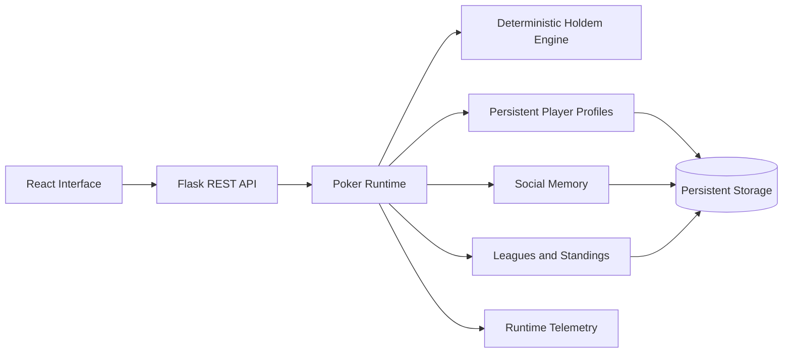
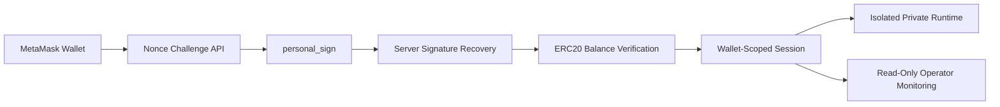

# OXY Poker

## Persistent Multi-Agent Poker Simulation Engine

OXY Poker is a simulation-first software project built around a deterministic
Texas Hold'em engine and a persistent world of autonomous player profiles.

The source repository remains private. This repository documents the verified
architecture, development process and working product.

## What the system does

- runs persistent six-player poker sessions
- maintains hero and bot profiles between sessions
- models player strategy, momentum and social relationships
- tracks leagues, standings and long-term progression
- exposes runtime state through a Flask REST API
- provides operator and player interfaces built with React
- records telemetry for hands, players and session behaviour
- supports optional AI-generated commentary and narrative layers

## Architecture

## Experimental Web3 integration

The project includes a working testnet wallet-access layer for an isolated
private game runtime.

- MetaMask connection through the browser provider
- expiring, single-use nonce challenges
- `personal_sign` wallet ownership proof
- server-side signature recovery with `eth-account`
- server-side ERC-20 `balanceOf` verification through Web3.py
- Sepolia testnet integration
- wallet-bound profiles and isolated private-table sessions
- read-only operator monitoring of wallet-auth lifecycle events

### Web3 security properties

- nonce expiration and one-time consumption prevent challenge replay
- nonce, signed message and normalized wallet address must match
- ownership is recovered and verified server-side
- token-gated access is decided from a server-side network read
- request-supplied identity cannot override session ownership
- private runtime state is isolated from the public game session

### Current Web3 boundaries

This is a testnet integration prototype. It does not implement WalletConnect,
deploy smart contracts or claim Solidity authorship. The current internal token
accounting is off-chain and does not call `approve`, `transferFrom` or burn
functions. The wallet interface uses browser JavaScript rather than Ethers.js,
Wagmi or Viem.

## Engineering priorities

- chip conservation and correct pot settlement
- legal betting actions and all-in edge cases
- deterministic engine behaviour
- stable API contracts
- separation of transient hands from persistent world state
- operator visibility through telemetry and diagnostics
- incremental development through documented checkpoints

## Development approach

OXY Poker was created through AI-assisted software development.

My responsibilities include product direction, requirements, architecture
decisions, agent coordination, acceptance testing, runtime verification and
approval of stable Git checkpoints. AI coding agents accelerate implementation,
but every delivered system is reviewed against explicit requirements.

## Technology

Python, Flask, React, Vite, REST APIs, Web3.py, eth-account, MetaMask, SQLite,
persistent storage, automated testing, Git and Linux.

## Current status

The engine, API, interfaces, persistent profiles, leagues, social memory,
telemetry and testnet wallet access are implemented as a working prototype.

The project remains under active development. Some older runtime components are
still being progressively modularized.

## Source availability

The production source code, runtime data, credentials, contract addresses and
infrastructure configuration are private. Screenshots, demonstrations and
additional architecture notes will be published here.
